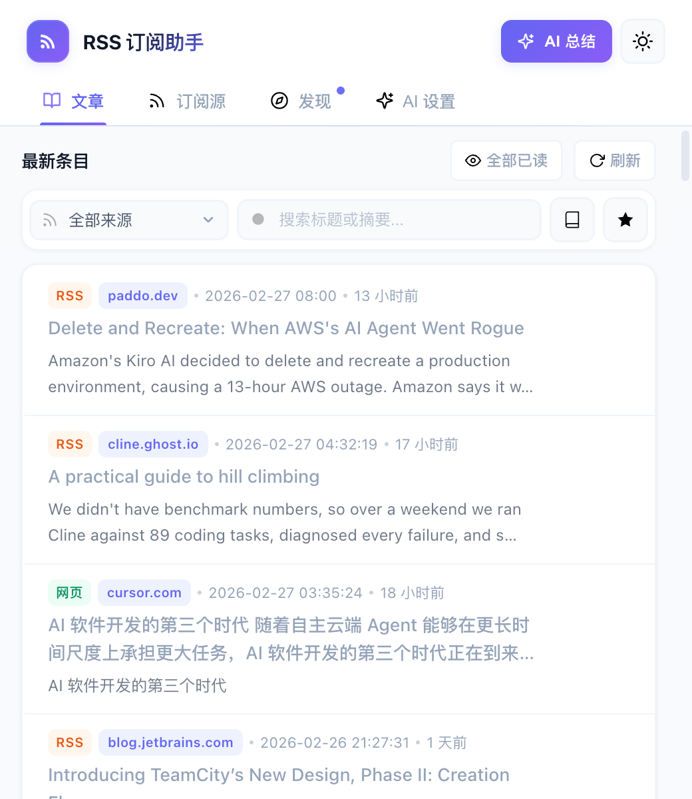
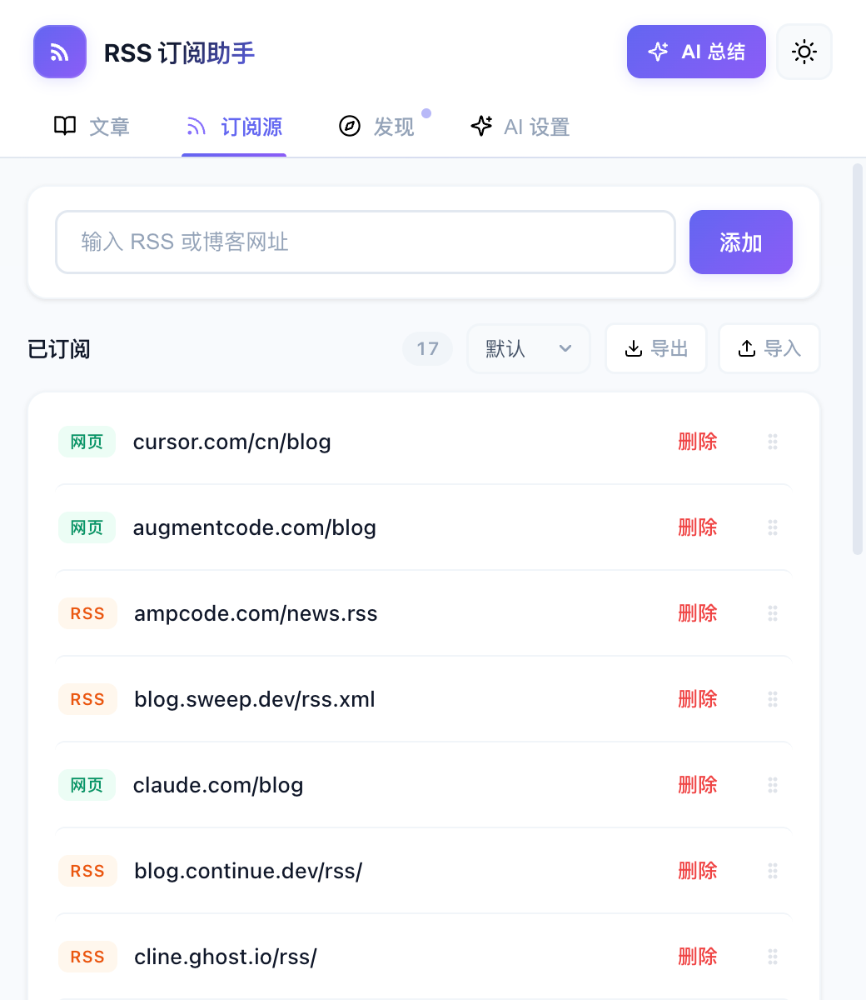
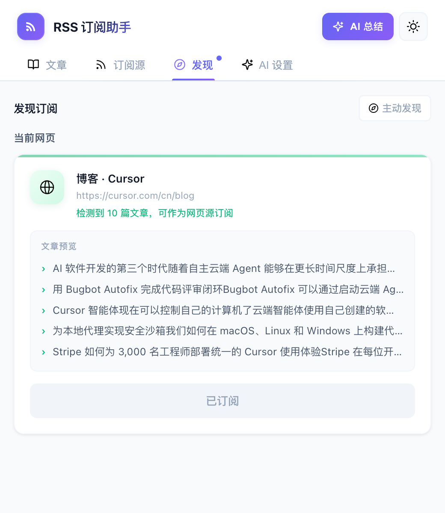
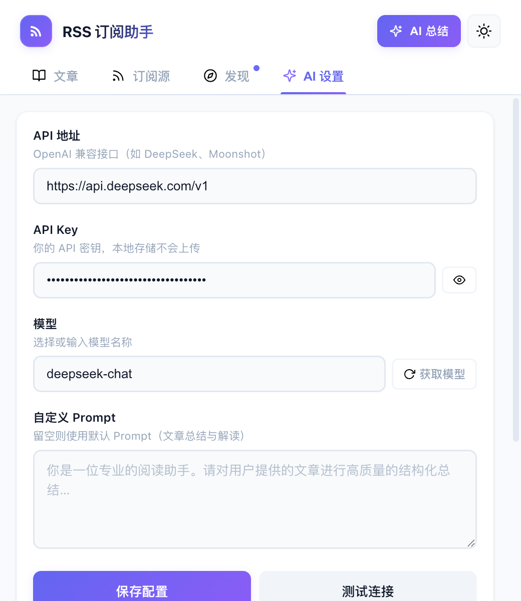

# 📡 Malo RSS 订阅助手

> **Malo RSS 订阅助手** —— 一款轻量级信息聚合工具，帮你管理和阅读来自任意网站的信息流。
> 提供 **Chrome 浏览器扩展** 和 **macOS 桌面应用（Electron）** 两种形态，共享同一套 UI 和业务逻辑。
> 支持标准 RSS/Atom 源，也能抓取无 RSS 输出的普通博客和 JS 渲染页面。

       

---

## 🤖 AI Coding 驱动开发

**Malo RSS 订阅助手**是一个 **100% AI Coding** 项目 —— 从架构设计、功能实现、UI 样式到 Bug 修复，所有代码均由 AI 编程助手（Malo / Cursor）生成，**未手写任何一行代码**。人工仅负责提出需求、验收效果和测试反馈，全程以自然语言驱动开发。

---

## 📸 界面预览

| 文章列表 | 订阅源管理 |
|:---:|:---:|
|  |  |

| 发现页面 | AI 设置 |
|:---:|:---:|
|  |  |

---

## ✨ 功能亮点

| 分类 | 功能 |
|------|------|
| 📥 **订阅管理** | 添加 / 删除 RSS 源，支持直接粘贴 RSS 地址或普通博客网址 |
| 🔍 **智能检测** | 自动识别源类型（RSS / 静态网页 / JS 渲染页面）并缓存 |
| 🔄 **后台抓取** | 定时自动抓取（默认 15 分钟），并发上限 3 |
| 🗂️ **三栏 UI** | 文章、订阅源、AI 设置 —— 信息一目了然 |
| 🔎 **筛选搜索** | 按来源筛选、关键词搜索、收藏过滤 |
| ⭐ **文章收藏** | 星标收藏文章，"只看收藏"模式不受列表数量限制 |
| 🤖 **AI 文章解读** | 集成 OpenAI 兼容 API，一键 AI 总结与深度解读文章内容 |
| 💬 **AI 问答对话** | 解读完成后可基于文章内容继续提问，支持多轮对话、快捷提问 |
| 📝 **总结当前网页** | 一键总结当前打开的网页，自动提取正文并通过 AI 生成摘要（仅 Chrome 扩展） |
| ⚙️ **自定义 Prompt** | 支持自定义 AI 系统提示词，灵活控制解读风格 |
| 🌐 **发现页面** | 自动检测当前页面中的 RSS/Atom 源与网页文章，一键订阅（仅 Chrome 扩展） |
| 🔔 **未读角标** | 扩展图标 / Dock 图标实时显示未读条目数 |
| 🖥️ **桌面应用** | macOS 原生应用体验，系统托盘、菜单栏、窗口管理 |
| 🌗 **深色模式** | 深色 / 浅色主题切换，偏好自动保存 |

---

## 🚀 快速开始

### 环境要求

- **Node.js** >= 18
- **npm** >= 9

### 安装依赖

```bash
git clone git@github.com:MrKiven/malo.git
cd malo
npm install
```

---

### Chrome 扩展

#### 构建

```bash
npm run build:extension
```

构建完成后，`dist/` 目录即为完整的 Chrome 扩展（已自动包含 `manifest.json` 和 `assets/`）。

#### 加载到 Chrome

1. 打开 `chrome://extensions/`
2. 右上角开启 **「开发者模式」**
3. 点击 **「加载已解压的扩展程序」**
4. 选择项目下的 **`dist/`** 目录

#### 开发模式

```bash
npm run dev
```

启动 Vite watch 模式，修改源码后自动重新编译。编译完成后到 `chrome://extensions/` 点击扩展的 🔄 刷新按钮即可生效。

#### 打包发布

```bash
npm run pack:extension
```

会在 `release/` 目录生成 `rss-chrome-extension-<版本号>-<时间戳>.zip`，可直接上传到 Chrome Web Store。

---

### macOS 桌面应用（Electron）

#### 构建

```bash
npm run build:app
```

构建完成后，`dist/` 为渲染进程资源，`dist-electron/` 为主进程代码。

#### 启动

```bash
npm run app
```

> **注意**：如果在 Cursor / VS Code 等 Electron 应用的终端中运行，环境变量 `ELECTRON_RUN_AS_NODE=1` 会导致 Electron 以纯 Node.js 模式启动。`app` 脚本已自动处理此问题。如需手动运行，请先执行 `unset ELECTRON_RUN_AS_NODE`。

#### 打包为 DMG

```bash
npm run pack:app
```

在 `release/` 目录生成 `.dmg` 和 `.zip` 安装包。

#### 开发模式

```bash
npm run dev:app
```

启动 Vite dev server + Electron，支持热重载。

---

### 导入预置订阅源

项目在 `feeds/` 目录下内置了精选订阅源文件（`rss-feeds-<日期>.json`），涵盖 Cursor、Claude、Windsurf、Cline、Zed、JetBrains 等 AI 编程工具的官方博客，开箱即用：

1. 安装并打开扩展或桌面应用，切换到 **订阅源** 标签页
2. 点击 **导入** 按钮，选择 `feeds/` 目录下日期最新的 JSON 文件
3. 导入完成后会自动开始抓取，稍等片刻即可在 **文章** 标签页浏览最新内容

> 💡 建议始终导入日期最新的文件以获取最完整的订阅源列表。你也可以在订阅源标签页点击 **导出** 按钮，随时备份自己的订阅列表。

---

## 📖 使用指南

| 标签页 | 说明 |
|--------|------|
| **文章** | 浏览最新条目；按来源 / 关键词筛选；点击星标收藏；"只看收藏"模式展示全部收藏文章 |
| **订阅源** | 输入 RSS 或博客网址点击"添加"；管理已订阅列表，支持按类型排序、删除（二次确认） |
| **发现** | 自动检测当前页面中的 RSS 源和网页文章内容，均可一键订阅（仅 Chrome 扩展） |
| **AI 设置** | 配置 AI API 地址、Key、模型和自定义 Prompt；支持连接测试 |

> 💡 **小提示**：筛选某个来源时会显示该源的全部条目（不受列表数量限制）。文章条目整行可点击跳转原文。

### AI 文章解读

1. 在 **AI 设置** 标签页中配置 API 地址、API Key 和模型
2. 配置完成后，文章列表中每篇文章会出现 **AI 总结** 按钮
3. 点击按钮会打开独立窗口进行 AI 解读（不受插件弹窗关闭影响）
4. 支持流式输出、停止生成、重新生成、复制内容
5. 可自定义 Prompt 控制解读风格，留空则使用默认的「核心摘要 + 关键要点 + 值得注意」结构

### AI 问答对话

1. AI 解读完成后，底部自动出现**对话输入框**和**快捷提问按钮**
2. 内置常用快捷提问：`核心观点`、`通俗解释`、`质疑与不足`、`延伸阅读`，一键发送
3. 也可以手动输入任意问题，按 Enter 发送（Shift+Enter 换行）
4. AI 会基于文章内容和之前的解读进行流式回答，支持**多轮连续对话**
5. 对话过程中可随时停止生成；历史自动保留最近 10 轮对话

### 总结当前网页（仅 Chrome 扩展）

1. 配置好 AI 后，工具栏右上角会出现 **AI 总结** 按钮
2. 在任意网页上点击此按钮，即可自动提取页面正文并由 AI 生成摘要
3. 通过注入脚本提取内容，优先识别 `<article>`、`<main>` 等语义区域，过滤导航、广告等无关元素
4. 若注入失败（如 chrome:// 页面），会自动回退到 fetch 抓取方式

> 支持任何 OpenAI 兼容的 API 接口（OpenAI、DeepSeek、Moonshot、Qwen 等），API Key 仅保存在本地。

---

## 🔧 抓取模式

| 类型 | 说明 | 适用场景 |
|------|------|----------|
| `rss` | 标准 RSS/Atom XML 解析 | 提供 RSS 输出的站点 |
| `page` | 正则抓取静态 HTML 中的文章链接 | 无 RSS 的博客 / 新闻站 |
| `page-js` | 后台标签页注入脚本，抓取 JS 渲染内容（仅 Chrome 扩展） | SPA、动态加载页面 |

首次添加源时自动检测类型并缓存，后续按已知类型直接抓取。

---

## 📁 项目结构

```
rss-chrome-extension/
├── manifest.json               # MV3 扩展配置
├── package.json                # 依赖管理 & 构建脚本
├── tsconfig.json               # TypeScript 编译配置（strict + paths alias）
├── vite.config.ts              # Chrome 扩展 Vite 构建配置
├── vite.electron.config.ts     # Electron 桌面版 Vite 构建配置
├── electron-builder.json5      # Electron 打包配置（macOS DMG/ZIP）
├── build.sh                    # Chrome 扩展打包脚本（输出 zip）
├── feeds/                      # 预置订阅源目录（按日期命名，导入最新即可）
├── assets/                     # 扩展图标 & UI 图标
│   ├── icon16/48/128.png       # 应用图标
│   ├── icons/*.svg             # UI 矢量图标
│   └── screenshots/            # 界面截图（README 展示用）
├── electron/                   # Electron 主进程代码
│   ├── main.ts                 # 主进程入口（窗口管理、macOS 生命周期）
│   ├── preload.ts              # 预加载脚本（contextBridge 暴露 IPC API）
│   ├── ipc-handlers.ts         # IPC 消息处理（storage / fetch / window）
│   ├── storage.ts              # electron-store 封装（sync / local 存储）
│   ├── fetcher.ts              # 后台定时抓取（Node.js fetch 实现）
│   └── tray.ts                 # macOS 系统托盘（菜单栏图标 + 右键菜单）
├── dist/                       # 构建产物 —— Chrome 扩展 / Electron 渲染进程
├── dist-electron/              # 构建产物 —— Electron 主进程
└── src/
    ├── platform/               # 平台抽象层
    │   └── index.ts            # 统一 API（自动切换 Chrome / Electron 实现）
    ├── popup/                  # 弹窗 / 主界面
    │   ├── index.html          # 界面 HTML（四栏标签页）
    │   ├── index.ts            # 入口（初始化各 UI 模块并协调交互）
    │   ├── theme.ts            # 主题切换（light / dark）
    │   ├── tabs.ts             # 标签页切换
    │   ├── feeds.ts            # 订阅源列表管理（添加/删除/导入/导出）
    │   ├── articles.ts         # 文章列表逻辑（筛选/收藏/标记已读/懒加载）
    │   ├── articles-render.ts  # 文章列表渲染（DOM 构建）
    │   ├── articles-ai.ts      # 文章 AI 总结入口
    │   ├── detect.ts           # 发现页：RSS 源检测 & 网页订阅
    │   ├── ai-settings.ts      # AI 设置面板
    │   └── shared.ts           # 共享 UI 工具（Toast、Loading bar、状态文本）
    ├── ai-panel/               # AI 解读独立窗口
    │   ├── index.html          # AI 解读窗口页面
    │   ├── index.ts            # 入口（总结流程、UI 控制）
    │   ├── summarize.ts        # 文章总结（内容提取 + 流式调用）
    │   ├── markdown.ts         # Markdown → HTML 渲染器
    │   └── chat.ts             # 多轮聊天问答
    ├── background/             # Chrome Service Worker
    │   └── index.ts            # 定时抓取、类型检测、标签页注入
    ├── content/                # Content Script
    │   └── detector.ts         # 检测页面 RSS 源 + 文章内容
    ├── services/               # 业务逻辑层（无 DOM 依赖）
    │   ├── storage/            # 存储封装（sync / local，含数据迁移）
    │   ├── ai.ts               # AI 服务（SSE 流式解析、总结、对话）
    │   ├── content.ts          # 内容提取（HTML / PDF）
    │   ├── parser.ts           # RSS/Atom XML 解析
    │   └── scraper.ts          # 静态 HTML 文章链接抓取
    ├── types.ts                # 共享 TypeScript 类型定义
    ├── constants.ts            # 常量定义
    └── styles/                 # 模块化样式
        ├── variables.css       # 设计令牌 & 主题变量（light / dark）
        ├── base.css            # 全局基础样式 & Electron 平台适配
        ├── components.css      # 通用组件（按钮、卡片、输入框等）
        ├── header.css          # 顶部栏 & 主题切换按钮
        ├── tabs.css            # 标签页导航
        ├── feeds.css           # 订阅源列表样式
        ├── articles.css        # 文章列表 & 筛选栏样式
        ├── discover.css        # 发现页样式
        ├── ai-panel.css        # AI 解读窗口样式
        └── ai-settings.css     # AI 设置表单样式
```

---

## 🏗️ 架构设计

### 平台抽象层

项目通过 `src/platform/index.ts` 实现了一套平台抽象层，统一封装了 `storage`、`runtime`、`tabs`、`scripting`、`windows` 等 API。运行时根据 `window.electronAPI` 是否存在自动选择 Chrome 或 Electron 实现，**UI 层代码完全无需感知运行平台**。

```
┌─────────────────────────────────┐
│          UI 层 (popup/)         │
│  articles / feeds / ai-settings │
└──────────────┬──────────────────┘
               │ platform.*
┌──────────────┴──────────────────┐
│        平台抽象层 (platform/)    │
├─────────────┬───────────────────┤
│ Chrome 实现  │  Electron 实现    │
│ chrome.*     │  electronAPI.*   │
└─────────────┴───────────────────┘
```

### Chrome 扩展架构

- **Popup**（渲染层）→ `chrome.runtime.sendMessage` → **Service Worker**（后台抓取、标签注入）
- **Content Script** 注入到目标页面检测 RSS 源

### Electron 桌面版架构

- **Renderer**（渲染层）→ IPC（`contextBridge`）→ **Main Process**（后台抓取、窗口管理、系统托盘）
- 数据通过 `electron-store` 持久化到本地文件
- 后台抓取使用 Node.js `fetch`，无需浏览器标签页
- `page-js` 抓取模式和「发现」功能在桌面版中不可用

---

## 🛠️ 技术栈

| 技术 | 说明 |
|------|------|
| **TypeScript** | 全量类型标注，strict 模式 |
| **Vite** | 多入口构建，自动处理 HTML/CSS/TS |
| **Chrome Extension MV3** | Service Worker、Content Script、chrome.storage API |
| **Electron 40** | macOS 桌面应用，主进程 + 渲染进程架构 |
| **electron-store** | Electron 本地持久化存储 |
| **electron-builder** | 桌面应用打包（DMG / ZIP） |
| **纯 DOM 操作** | 无前端框架依赖，轻量快速 |

---

## 💾 存储策略

### Chrome 扩展

| 存储类型 | 内容 | 说明 |
|----------|------|------|
| `chrome.storage.sync` | 订阅源列表、源类型、收藏、主题偏好、AI 配置 | 登录同一 Google 账号即可跨浏览器同步 |
| `chrome.storage.local` | 文章缓存 | 数据量大，可重新抓取恢复 |

### Electron 桌面版

| 存储类型 | 内容 | 说明 |
|----------|------|------|
| `electron-store` (sync-data) | 订阅源列表、源类型、收藏、主题偏好、AI 配置 | JSON 文件，存于 `~/Library/Application Support/malo-rss/` |
| `electron-store` (local-data) | 文章缓存、已读状态 | 同上 |

**数据限制：**
- 每个订阅源最多保留 **50 条**条目
- 合并视图（全部来源）默认显示 **50 条**；按来源筛选或只看收藏时展示全部
- Chrome 扩展：Sync 单 key 上限 8 KB，收藏文章摘要会自动截断；若超限自动回退到 local

---

## ⚠️ 已知限制

- 某些站点可能存在 **CORS / UA / 防爬**限制，抓取失败属正常现象
- `page-js` 模式抓取时会在后台短暂创建标签页并自动关闭（仅 Chrome 扩展）
- Chrome 扩展需要 Chrome **110+** 版本（Manifest V3）
- Electron 桌面版不支持「发现」功能和 `page-js` 抓取模式（无浏览器标签页环境）

---

## 🛠️ 权限说明（Chrome 扩展）

| 权限 | 用途 |
|------|------|
| `storage` | 存储订阅源、文章缓存、用户偏好 |
| `alarms` | 定时后台抓取 |
| `activeTab` | 检测当前页面内容 |
| `scripting` | 注入脚本抓取 JS 渲染页面 |
| `tabs` | 后台标签页管理（page-js 模式） |
| `notifications` | 新文章通知（预留） |
| `<all_urls>` | 允许抓取任意站点的 RSS / 网页内容 |

---

## 📜 NPM 脚本速查

| 脚本 | 说明 |
|------|------|
| `npm run dev` | Chrome 扩展开发模式（Vite watch） |
| `npm run dev:app` | Electron 开发模式（Vite dev server + Electron） |
| `npm run app` | 启动 Electron 桌面应用 |
| `npm run build` | 一键构建 Chrome 扩展 + Electron 应用 |
| `npm run build:extension` | Chrome 扩展生产构建 |
| `npm run build:app` | Electron 生产构建 |
| `npm run pack` | 一键打包全部（Chrome .zip + macOS DMG/ZIP） |
| `npm run pack:extension` | Chrome 扩展打包为 .zip |
| `npm run pack:app` | Electron 打包为 macOS DMG/ZIP |
| `npm run clean` | 清理所有构建产物 |
